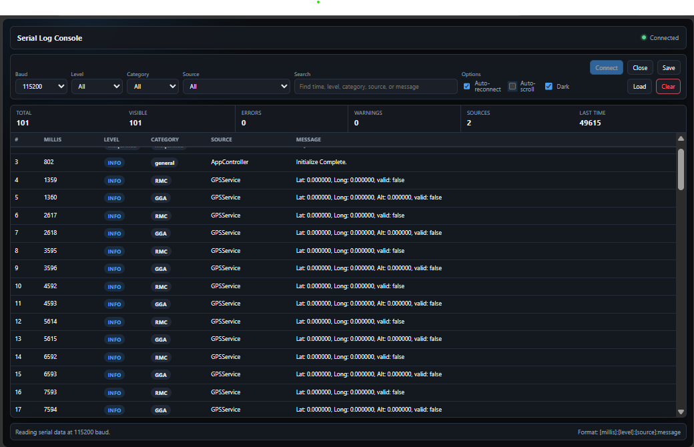

# Serial Log Console

Serial Log Console is a single-page web application for viewing structured logs from a serial device. It uses the browser's Web Serial API to connect to a host serial port, parse incoming log lines, and display them in a compact searchable table.

The project is intentionally dependency-free. The entire application lives in `index.html` and can be opened directly in a compatible browser, though serving it from `localhost` is the most reliable way to use Web Serial.

## Features

- Connect to a serial port from the browser.
- Select common baud rates before opening the port.
- Automatically reconnect to a previously selected port when possible.
- Parse structured log lines in this format:

  ```text
  [time in millis]:[log level]:[src component]:log message
  ```

- Display logs in a scrolling table that does not grow the page.
- Search across time, level, category, source, message, and raw line content.
- Filter by log level, source component, and derived category.
- Show counters for total logs, visible logs, errors, warnings, unique sources, and latest timestamp.
- Save captured logs to a text file.
- Load logs from a text file.
- Toggle dark and light mode.
- Keep the table pinned to the latest entries with optional auto-scroll.
- Preserve malformed lines as visible rows instead of silently discarding them.

## Interface


## Browser Requirements

Web Serial is only available in browsers that implement the Web Serial API, such as current Chromium-based browsers:

- Google Chrome
- Microsoft Edge
- Other Chromium browsers with Web Serial enabled

Firefox and Safari do not currently support Web Serial.

Web Serial also requires a secure context. These are usually valid:

- `https://...`
- `http://localhost`
- `http://127.0.0.1`
- In some browser configurations, a local `file://` URL

If the app opens but the Connect button reports that Web Serial is unavailable, use Chrome or Edge and serve the folder from `localhost`.

## Running The App

### Option 1: Open The File Directly

Open `index.html` in Chrome or Edge.

This is the simplest option, but Web Serial support from `file://` can vary by browser and policy.

### Option 2: Serve From Localhost

From the project directory:

```powershell
python -m http.server 8000
```

Then open:

```text
http://localhost:8000
```

If Python is not available, any static file server works. There is no build step.

## Log Format

Each incoming log line should use this structure:

```text
[millis]:[level]:[source]:message
```

Example:

```text
[1024]:[INFO]:[sensor]:temperature initialized
[1138]:[WARN]:[network]:[wifi] reconnect attempt 1
[2048]:[ERROR]:[motor]:category=drive overcurrent detected
```

Parsed fields:

| Field | Description |
| --- | --- |
| `millis` | Device timestamp in milliseconds. Must be numeric. |
| `level` | Log level, such as `INFO`, `WARN`, `ERROR`, `DEBUG`, or `TRACE`. |
| `source` | Source component that produced the log. |
| `message` | Remaining text after the third colon separator. |

The parser expects square brackets around the first three fields. The message may contain additional colons.

Malformed lines are still shown in the table with level and category set to `malformed`.

## Categories

The base log format does not include a dedicated category field, so the app derives one from the message when possible.

Supported message category patterns:

```text
[network] connected
category=network connected
category:network connected
cat=network connected
cat:network connected
```

If no category is present, the category is set to:

```text
general
```

## Controls

| Control | Purpose |
| --- | --- |
| `Baud` | Baud rate used when opening the serial port. |
| `Level` | Filters visible rows by log level. |
| `Category` | Filters visible rows by derived category. |
| `Source` | Filters visible rows by source component. |
| `Search` | Searches all visible log fields and raw line text. |
| `Auto-reconnect` | Attempts to reopen the selected port after a disconnect or read failure. |
| `Auto-scroll` | Keeps the scrolling table pinned to the latest visible row. |
| `Dark` | Toggles dark and light theme. |
| `Connect` | Selects and opens a serial port, or reopens a previously granted port. |
| `Close` | Closes the active serial connection. |
| `Save` | Downloads the current logs as a text file. |
| `Load` | Imports log lines from a text file. |
| `Clear` | Clears all logs from the current session. |

## Saving And Loading Logs

Saved logs use the original raw log lines, one line per entry. This keeps the exported file compatible with the loader and with other text-based tools.

Loading a file appends its logs to the current session. Use `Clear` first if you want to replace the current logs.

## Display Limits

The app keeps all loaded and captured logs in memory for the current browser session. To avoid rendering too many DOM rows at once, the table displays the latest 2,000 rows that match the current filters.

The visible count still reflects all matching logs, even when only the latest 2,000 are rendered.

## Serial Permissions

Browsers require a user gesture before a page can request serial-port access. Press `Connect` and choose the target device from the browser prompt.

After a port has been granted, the browser may remember that permission. In that case, the app can detect the previously granted port and let you reopen it without selecting it again.

## Troubleshooting

### Connect says Web Serial is unavailable

Use Chrome or Edge, and open the app from `http://localhost` instead of a plain file URL.

### No ports appear in the browser prompt

Check that the device is connected, the operating system can see it, and no other program is holding the port open.

### The port opens but no logs appear

Verify the selected baud rate and confirm that the device is sending newline-terminated text. The app processes lines after receiving `\n`.

### Rows appear as malformed

Confirm the device is emitting lines in this exact shape:

```text
[12345]:[INFO]:[component]:message text
```

### Auto-reconnect does not restore the connection

Auto-reconnect can only reopen a port the browser still recognizes and the operating system allows. Some USB serial devices appear as a new port after unplugging and reconnecting, which may require pressing `Connect` again.

## Project Structure

```text
.
├── index.html
└── README.md
```

`index.html` contains the HTML, CSS, and JavaScript for the full app.

## Development Notes

- No package manager is required.
- No framework or bundler is used.
- The app uses `TextDecoderStream` to read serial data as text.
- Incoming data is buffered until newline boundaries are received.
- Exported files contain raw original lines rather than formatted table data.
- The UI is designed for dense log viewing with small type and a fixed-height scrolling log panel.

## License

No license has been specified yet.
